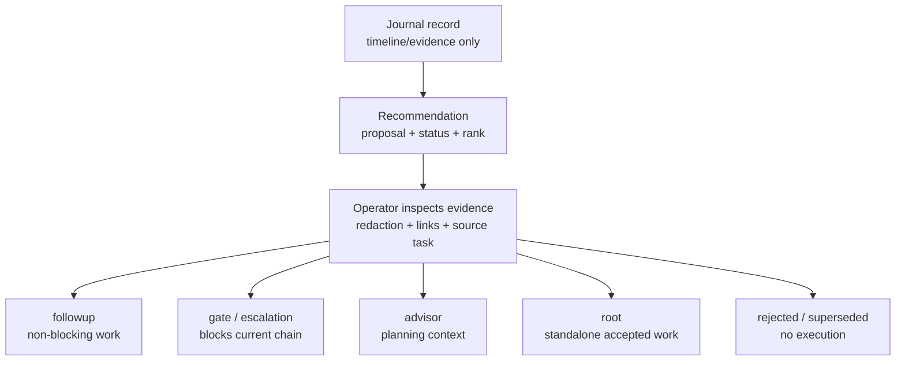

# xtrm DevOps Journal And Recommendation Spec

Status: planning output for `forge-ow7c.7`, pre-implementation.

This spec defines how Console Operations should render DevOps Agent-style
journals and recommendations while preserving substrate class semantics.

## Promotion Flow

Journals remain evidence. Recommendations become work only through explicit
promotion, and the chosen target class is determined by runtime effect rather
than by the wording of the recommendation.

## Source Model

AWS DevOps Agent provides useful shape, not authority:

- tasks/investigations have lifecycle state;
- journals preserve investigation records;
- recommendations have status, rank/priority, content, and task linkage;
- mitigation/customer approval state is first-class.

For xtrm, these are evidence and proposal objects. They do not automatically
become issue graph nodes.

## Journal UX

Journals are timeline/evidence.

Display fields:

- task/investigation id
- source system
- timestamp
- summary/title
- related evidence refs
- trace/span/job/bead correlation when available
- redaction status

Rules:

- Journal entries are not issues by default.
- Journal entries may link to existing beads/jobs/chains.
- Journal entries may support "create recommendation/follow-up" only through an
  explicit operator action.
- Journal body is redacted/truncated by default when upstream marks it redacted.

## Recommendation UX

Recommendations are proposals with state.

Display fields:

- recommendation id
- title
- source task/investigation
- priority/rank
- status: `proposed`, `accepted`, `rejected`, `closed`, `completed`,
  `update_in_progress`, or upstream equivalent
- approval state
- evidence refs
- proposed promotion target
- owning repo/system

Operator actions:

- inspect evidence
- accept as non-blocking follow-up
- escalate as current-chain gate/blocker
- accept as standalone root work
- mark as advisor context for planned work
- reject with reason
- supersede with linked recommendation or bead

## Substrate Class Mapping

Promotion target depends on runtime effect, not recommendation wording.

| Recommendation effect | Substrate/beads target | Blocking? | Example |
|---|---|---:|---|
| Non-blocking operational improvement | `class: followup` / bd task related by discovered-from | no | Add dashboard for slow queue drain. |
| Current-chain safety condition | `class: gate` or escalation evidence | yes | Deployment must not proceed until backup freshness verified. |
| Pre-work guidance | `class: advisor` context | no by itself | Consider canary before changing exporter retention. |
| Accepted standalone change | `class: root`, type chosen by work kind | separate root | Implement Loki scrape config. |
| Duplicate/obsolete advice | superseded/rejected state | no | Same fix already tracked. |

Rules:

- The UI must show the chosen target and why it blocks or does not block.
- Recommendation acceptance does not execute remediation.
- Gate/escalation promotion requires evidence and an explicit operator or policy
  approval state.
- Root/follow-up creation must preserve source recommendation id in evidence,
  not as a Prometheus label.

## Console Surfaces

### Recommendation List

Dense table grouped by:

- status
- priority/rank
- owning repo
- target class
- freshness

### Recommendation Detail

Detail drawer sections:

- summary/content
- evidence refs
- source task/journal records
- proposed target class
- approval history
- linked bead/job/PR/runbook
- promotion actions

### Journal Timeline

Timeline attached to:

- incident/task
- bead/job
- source-health event
- Operations panel drilldown

The journal timeline remains read surface unless the operator explicitly creates
work from it.

## Acceptance Checklist

- Journals render as evidence/timeline, not issue nodes.
- Recommendations expose status/rank/approval/evidence.
- Promotion target is explicit: followup, gate, advisor, or root.
- Blocking effect is visible before creation.
- Every created bead/follow-up preserves source recommendation/journal evidence.
- No source ids become Prometheus labels.
