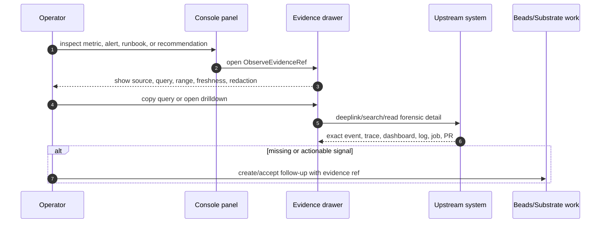

# xtrm Operations Evidence UX Spec

Status: planning output for `forge-ow7c.6`, pre-implementation.

This spec defines how Console Operations presents telemetry evidence without
replacing Grafana, Prometheus, Loki, specialists forensic state, or substrate.
It does not define final visual design.

## Evidence Interaction Flow

Evidence is an interaction contract, not only a data type. The operator should
always be able to move from an aggregate panel to the exact upstream proof, then
optionally create work with that proof attached.

## Core Rule

Console renders context and decisions. Upstream systems remain source of truth.
The operator must always be able to see:

- source system
- exact upstream name
- query or lookup used
- time range
- freshness/cache status
- redaction status
- drilldown/deeplink
- owning repo for missing signals

No decorative renames for metric names, labels, alert names, datasource ids,
dashboard titles, trace/span ids, job ids, or recommendation ids.

## Evidence Drawer

The evidence drawer is polymorphic by `ObserveEvidenceRef.kind`.

Required header fields:

- evidence title
- kind
- source
- datasource id
- time range
- freshness/cache status
- redaction status

Required body sections:

- query or lookup text, copyable
- correlation ids, copyable but never used as labels
- upstream links/deeplinks
- related bead/job/chain/repo links
- missing-signal owner and suggested follow-up when applicable

Supported evidence kinds:

- `prometheus_query`
- `grafana_dashboard`
- `grafana_panel`
- `loki_query`
- `trace_span`
- `specialist_forensic_event`
- `specialist_job`
- `eval_result`
- `alert`
- `journal_record`
- `recommendation`
- `runbook`
- `bead`
- `github`

## Alert Evidence

Alert rows should show:

- upstream alert name exactly
- state/severity
- datasource/source
- firing window
- bounded labels
- linked panel/query
- runbook ref
- current approval/escalation state when attached to agent action

Actions:

- open evidence drawer
- open upstream Grafana/Alertmanager deeplink
- open related bead/job if known
- create follow-up only through a separate accepted action

Non-goals:

- no alert rule editing in Phase 0/1
- no alert threshold ownership in Console
- no raw label explosion in row UI

## Runbook Links

Runbook refs may point to:

- infra docs
- service skills
- second-mind design notes
- repository docs
- future substrate issue/evidence refs

Rules:

- Runbook title preserves upstream/doc title.
- Console may render summary metadata, but the owning doc remains authoritative.
- Missing runbook is a missing-signal evidence item, not a silent empty state.

## Agent-Authored Panels

An agent may propose:

- existing dashboard ref + time range/variables
- draft dashboard JSON spec
- single panel insert
- query explanation with evidence refs

States:

- `draft`
- `validating`
- `needs_operator_approval`
- `accepted`
- `rejected`
- `superseded`

Validation before approval:

- schema version valid
- datasource id exists
- query has bounded range/limits
- no forbidden labels
- write target is local Console draft state only
- evidence refs are present for generated claims

Operator actions:

- preview
- accept as transient panel
- accept as dashboard draft
- reject with reason
- create follow-up bead

Persistent writes require explicit operator approval. Agent output never writes
Grafana dashboards, alert rules, incidents, or annotations in this tranche.

## Panel Drilldown

Every panel supports:

- copy query
- open evidence drawer
- open upstream deeplink when available
- inspect freshness/cache status
- inspect missing signal owner
- open related Bead Inspector when an evidence ref includes bead/job context

Panel errors are local to the panel. One datasource failure must not blank the
Operations page or sibling panels.

## Regression Expectations

Future implementation must preserve:

- existing Console Operations route
- Bead Inspector drawer/back stack
- Chain-to-Bead Inspector opening
- source health badges until parity replacement is proven
- no visual redesign or app rename in this tranche

## Acceptance Checklist

- Every alert/runbook/panel evidence item preserves upstream names.
- Evidence drawer can render every `ObserveEvidenceRef.kind`.
- Agent-authored panels require validation and operator approval.
- Missing signals show owner and suggested next action.
- Grafana is linked/deep-linked, not recreated as the authority.
