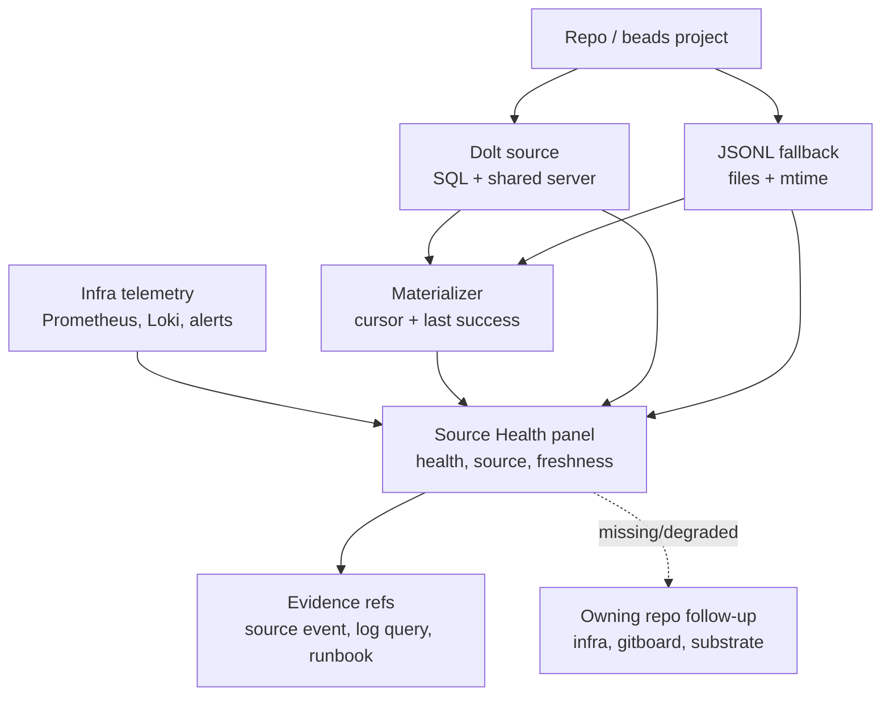

# xtrm Source Health Evidence Spec

Status: planning output for `forge-ow7c.5`, pre-implementation.

This spec moves Beads/Dolt/source-health UI from bespoke status chips toward the
shared observability datasource/evidence model. It does not remove existing
fallback behavior; it defines the target contract for future implementation.

## Health Evidence Map

The panel separates three questions that current chips can blur together:
whether the source is healthy, whether the fallback/cache is fresh, and whether
the materializer is keeping the read model current.

## Current Bridge Reality

Gitboard/Console currently derives source health from local app paths:

- project scanner reads `.beads/config.yaml`, shared-server port files, and
  metadata to detect Dolt config;
- `graph-dao` and materializer paths attempt Dolt reads and fall back to JSONL;
- `beads-change-watcher` emits `beads:source_health` and Dolt issue events;
- repo tree source badges show `dolt`, `jsonl`, `error`, or `unknown`;
- deployment docs keep Dolt local to the host and route through configured host
  and port.

This stays valid in bridge era because it protects the user-facing Beads feed.
The change is that these local probes become evidence sources, not the long-term
source of observability truth.

## Target Surfaces

### Source Health Summary

Purpose: quick operator signal for each repo.

Fields:

- repo id/slug
- current source: `dolt`, `jsonl`, `sqlite`, `substrate`, `missing`, `unknown`
- health: `healthy`, `degraded`, `stale`, `unreachable`, `error`
- freshness: observed time, source update time, cache status
- fallback reason
- evidence refs

Evidence refs:

- current local source-health event
- Prometheus target state when available
- Loki/log query for recent Dolt/source errors
- materializer run/failure event
- future substrate daemon/API health

### Dolt Evidence Panel

Purpose: show Dolt as an upstream data source, not only as a green/red chip.

Signals:

- Dolt SQL reachable/unreachable
- shared server port/config present
- query success/failure count
- query latency if emitted
- fallback-to-JSONL count
- last successful snapshot/read
- connection pressure or breaker state when emitted

Bridge sources:

- app log events such as `graph.source.timing`
- `beads:source_health`
- materializer `beads-snapshot` logs
- local deployment config

Infra-owned future sources:

- Prometheus scrape target for a Dolt/exporter or probe
- Loki container/application logs
- alert rule for repeated unreachable/fallback
- dashboard deeplink in Grafana

### JSONL Fallback Panel

Purpose: make fallback visible without treating fallback as failure when it is
expected.

Signals:

- fallback active/inactive
- JSONL mtime age
- Dolt missing config vs Dolt unreachable vs Dolt query failed
- issue count from fallback snapshot
- stale fallback age threshold

Rules:

- JSONL fallback is `degraded` when Dolt was expected.
- JSONL fallback may be `healthy` only for repos explicitly configured as
  non-Dolt.
- UI must show data freshness, not just source label.

### Materializer Freshness Panel

Purpose: connect source health to state.db freshness.

Signals:

- last materializer run time
- rows written
- source cursor
- fallback used
- schema mismatch/failure
- state.db freshness per repo/project

Rules:

- Materializer freshness is not Dolt health.
- A healthy Dolt source with a stale materializer is an app/materializer issue.
- An unhealthy Dolt source with a fresh last-successful cache is degraded but
  still renderable.

## Metric/Evidence Mapping

The following metrics should be consumed when infra/specialists expose them.
Until then, panels render `missing_signal` with owner metadata.

| Panel signal | Preferred metric/evidence | Owner |
|---|---|---|
| Prometheus target up | `up{job=...}` or target-health datasource response | `mercury/infra` |
| Dolt query/fallback count | future `xtrm_source_reads_total{source,result}` or forensic source event | `gitboard` bridge, later substrate/infra |
| Dolt query duration | future `xtrm_source_read_duration_seconds` | `gitboard` bridge if needed |
| Materializer run/failure | `xtrm_forensic_events` / materializer forensic events | `gitboard` materializer |
| Worktree/process health | `xtrm_processes`, `xtrm_process_orphans_total` | `specialists` / core |
| Logs | Loki labels `service`, `stack`, `container`, plus bounded time range | `mercury/infra` |
| Alerts | Grafana/Alertmanager evidence refs | `mercury/infra` |
| Substrate daemon | future substrate live health API | `substrate` |

## Guardrails

- Do not treat container/host metrics as app-health truth. CPU/memory/process up
  is infra evidence; app health requires service-level RED/SLI or source-read
  success.
- Do not add raw repo paths, database names from user input, port numbers, raw
  error text, or URLs as Prometheus labels.
- Preserve current source-health chips until datasource-backed evidence reaches
  parity.
- Every degraded/unknown state needs an evidence ref and a suggested owning repo.
- The Console UI must preserve upstream names exactly for metrics, alerts,
  datasource ids, and dashboard titles.

## Implementation Follow-Ups

Create these after the datasource contract and fixture datasource exist:

- Source Health evidence fixture pack with Dolt healthy, Dolt unreachable,
  JSONL fallback, stale fallback, materializer stale, and future substrate live
  cases.
- Source Health summary adapter that converts current `SourceHealth` objects to
  `ObserveEvidenceRef` and `ObserveQueryResponse` fixtures.
- Regression tests that existing repo-tree source badges remain correct while
  evidence panels are added.
- Missing-signal routing tests for infra-owned Prometheus/Loki/Dolt exporter
  gaps.

## Acceptance Checklist

- Current Beads feed/source fallback behavior remains stable.
- Source health panel can distinguish source health, fallback freshness, and
  materializer freshness.
- Every source state has at least one evidence ref or a missing-signal owner.
- Future substrate state is read live via substrate API/daemon and cached
  last-successful; it is not copied into a new SQLite materialization.
